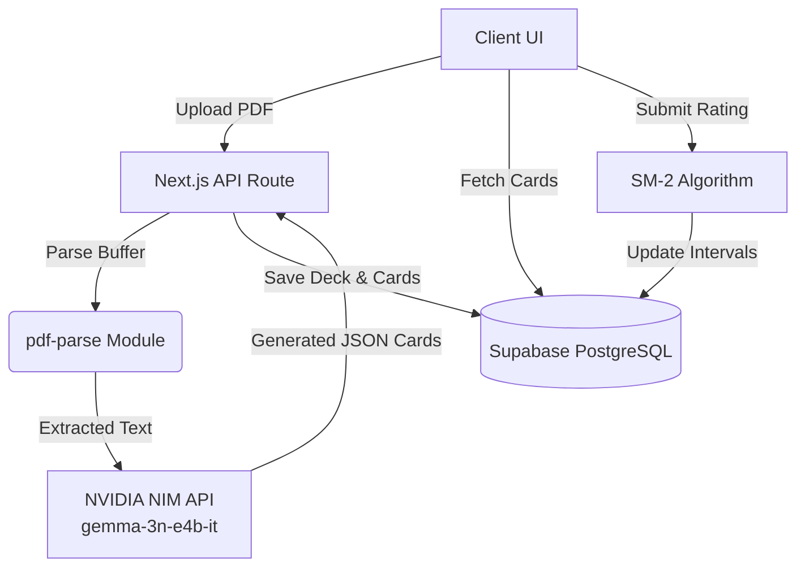

<div align="center">


<br/><br/>

[](https://your-vercel-link.vercel.app)
[](https://vercel.com/new/clone?repository-url=https://github.com/kinshukkush/recallai)


</div>

<br/>

<div align="center">
  
╔════════════════════════════════════════════════════════════════════════╗
║                                                                        ║
║   RecallAI is a production-ready web application that instantly        ║
║   transforms your study materials into interactive flashcard decks.    ║
║   Powered by the NVIDIA gemma-3n-e4b-it model and SM-2                 ║
║   spaced repetition, it guarantees you never forget what you read.     ║
║                                                                        ║
╚════════════════════════════════════════════════════════════════════════╝

</div>

<br/>

## ◈ Tech Stack

<div align="center">


</div>

## ◈ Key Features

| Feature | Description |
| :--- | :--- |
| **PDF Extraction Engine** | Automatically extracts and cleans text from any PDF using `pdf-parse`. |
| **AI Flashcard Generation** | Powered by Gemma-3, generating precise Q&A with dynamic difficulty levels. |
| **Spaced Repetition (SM-2)** | Adapts card intervals intelligently based on user rating (`Again`, `Hard`, `Good`, `Easy`). |
| **"Explain Better" Mode** | Distills complex answers into simple, digestible terms using AI. |
| **Real-time Analytics** | Provides insights on tracked learning progress, mastery percentage, and daily due counts. |
| **Premium 3D UI/UX** | Dark glassmorphism aesthetics with interactive 3D flip card animations. |

## ◈ Data Architecture



## ◈ API Endpoints

| Endpoint | Method | Purpose |
| :--- | :--- | :--- |
| `/api/generate-cards` | `POST` | Processes a PDF upload and uses AI to generate a deck. |
| `/api/review-card` | `POST` | Applies SM-2 algorithm to a reviewed card and updates the DB. |
| `/api/explain` | `POST` | Calls NVIDIA API to simplify a complex flashcard answer. |
| `/api/decks` | `GET` | Retrieves all decks, calculating daily due counts. |
| `/api/decks` | `DELETE` | Deletes a deck and cascades to remove all associated cards. |
| `/api/decks/[id]` | `GET` | Fetches a specific deck along with its corresponding internal cards. |

## ◈ How to Run Locally

### 1. Clone & Install
```bash
git clone https://github.com/kinshukkush/recallai.git
cd recallai
npm install
```

### 2. Configure Environment
Create a `.env.local` file with the following keys:
```env
NVIDIA_API_KEY=your_nvidia_api_key
NEXT_PUBLIC_SUPABASE_URL=your_supabase_url
NEXT_PUBLIC_SUPABASE_PUBLISHABLE_KEY=your_supabase_anon_key
SUPABASE_DB_PASSWORD=your_db_password
```

### 3. Setup Database
Run the schema script located in `supabase/schema.sql` within your Supabase SQL Editor to generate the tables and RLS policies.

### 4. Start Development Server
```bash
npm run dev
```


<br/>

<div align="center">


[](https://github.com/kinshukkush)
[](https://linkedin.com/in/kinshuk-saxena-/)
[](https://kinshuk.unaux.com)
[](mailto:kinshuksaxena3@gmail.com)

*“Bridging complex AI with intuitive design.”*

⭐ **If you like this project, please consider giving it a star!** ⭐


</div>
